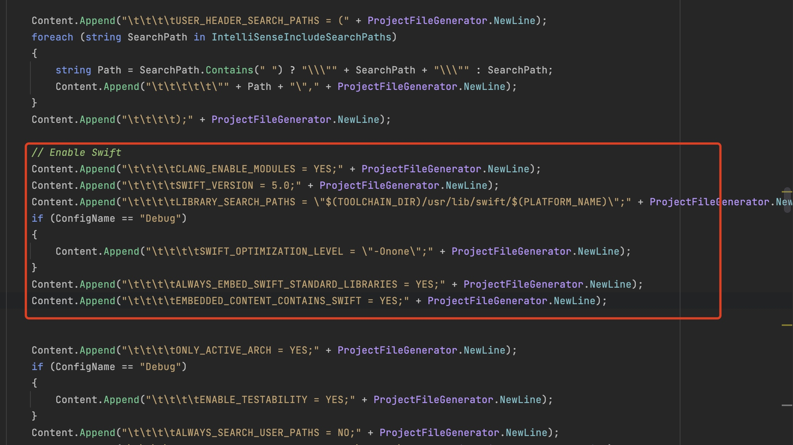
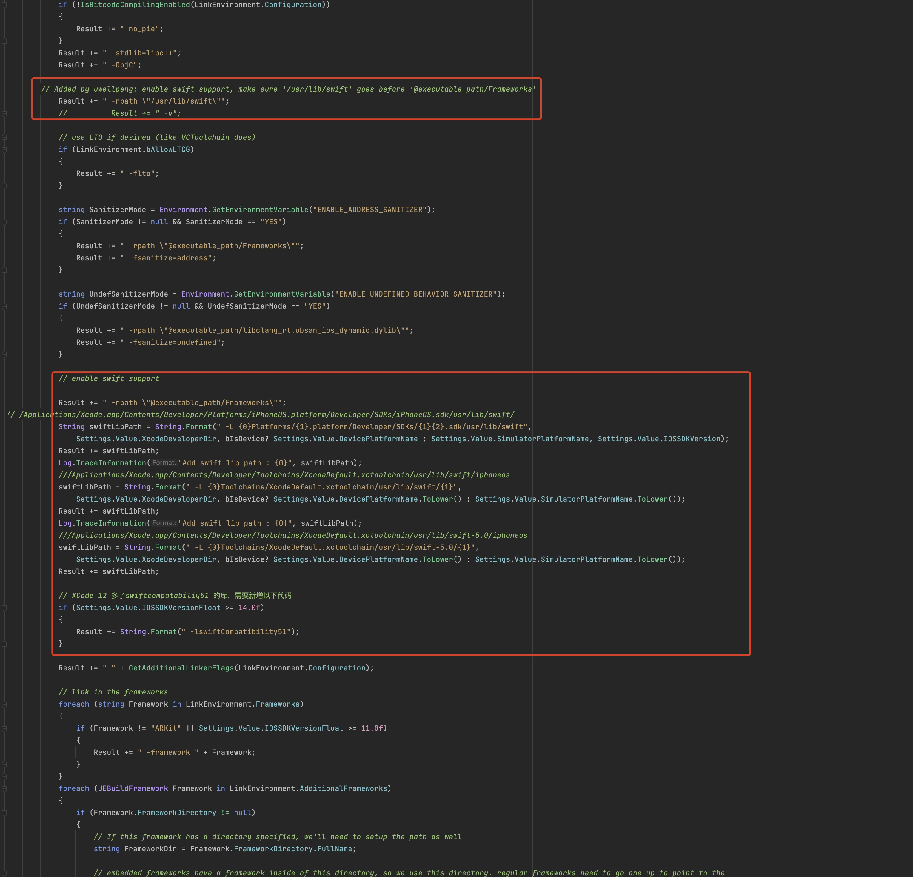

# AntiAddiction

## 支持平台

* Android
* iOS
* Windows
* macOS

## 前提条件

* 安装 **UE 4.26** 及以上版本
* IOS **12** 或更高版本 
* Android MinSDK 为 **API21** 或更高版本
* macOS 为 **10.14.0** 或更高版本
* Windows 为 **Windows 7** 或更高版本

## 如何使用

### 安装插件

* 下载 **TapSDK.zip** 解压后将 `AntiAddiction`、`TapCommon` 文件夹 `Copy` 到项目的 `Plugins` 目录中
* 重启 Unreal Editor
* 打开 **编辑 > 插件 > 项目 > TapTap**，开启 `AntiAddiction` 模块

### 依赖所需模块
在 **Project.Build.cs** 中添加所需模块:
```c#
PublicDependencyModuleNames.AddRange(new string[] { "Core",
	"CoreUObject",
	"Engine",
	"Json",
	"InputCore",
	"JsonUtilities",
	"SlateCore",
	"TapCommon",
	"AntiAddiction"
});
```

### 导入头文件
```cpp
#include "TapUEBootstrap.h"
```

## AntiAddiction API

### 初始化

```cpp
FAAUConfig Config;
Config.ClientID = TEXT("your clinet id");
Config.ShowSwitchAccount = true;
Config.UseTapLogin = true;  // taptap 快速实名不支持 PC 版
AntiAddictionUE::Init(Config);
```

### 防沉迷事件回调

防沉迷启动后，会有各种事件的回调，所以需要监听回调`AntiAddictionUE::OnCallBack`，具体的事件可以参考`AntiAddictionUE::ResultHandlerCode`值。
```cpp
// 绑定AntiAddictionUE::OnCallBack回调
AntiAddictionUE::OnCallBack.BindUObject(this, &UAntiAddictionWidget::OnCallBack);

void UAntiAddictionWidget::OnCallBack(AntiAddictionUE::ResultHandlerCode Code, const FString& Message) {
	TUDebuger::DisplayShow(FString::Printf(TEXT("Code: %d, Message: %s"), Code, *Message));
	switch (Code) {
	case AntiAddictionUE::LoginSuccess:
		TUDebuger::DisplayShow(TEXT("登录成功"));
		break;
	case AntiAddictionUE::Exited:
		TUDebuger::DisplayShow(TEXT("用户登出"));
		break;
	case AntiAddictionUE::SwitchAccount:
		TUDebuger::DisplayShow(TEXT("切换账号"));
		break;
	case AntiAddictionUE::DurationLimit:
		TUDebuger::DisplayShow(TEXT("时长耗尽，用户当前无法进行游戏"));
		break;
	case AntiAddictionUE::PeriodRestrict:
		TUDebuger::DisplayShow(TEXT("宵禁时间，用户当前无法进行游戏"));
		break;
	case AntiAddictionUE::RealNameStop:
		TUDebuger::DisplayShow(TEXT("取消实名"));
		break;
	default:
		TUDebuger::WarningLog(TEXT("未知回调的Code: ") + FString::FromInt(Code));
		break;
	}
}
```

### 启动防沉迷
```cpp
AntiAddictionUE::Startup(TEXT("user id"));
```

### 进入&&退出游戏

相关API：
```cpp
AntiAddictionUE::EnterGame();
AntiAddictionUE::LeaveGame();
```
在游戏进入后台，或者从后台激活时，可以调用相关API，`LeaveGame`会暂停防沉迷的计时，`EnterGame`会开始防沉迷的计时

### 防沉迷登出
```cpp
AntiAddictionUE::Exit();
```

在游戏退出的时候，应该调用该方法让防沉迷一起退出


### 获取用户的年龄段
```cpp
EAAUAgeLimit AgeLimit = AntiAddictionUE::GetAgeRange();
```

### 获取用户剩余的可玩时长
```cpp
int RemainingTime = AntiAddictionUE::GetRemainingTime(); // 单位秒
int RemainingTimeInMinutes = AntiAddictionUE::GetRemainingTimeInMinutes(); // 单位分钟
```

### 获取用户防沉迷Token
```cpp
FString Token = AntiAddictionUE::CurrentToken();
```

### 检查用户是否还能支付
```cpp
AntiAddictionUE::CheckPayLimit(FCString::Atoi(*AmountTF->Text.ToString()), [](bool Status) {
    TUDebuger::DisplayShow(FString::Printf(TEXT("Status: %d"), Status));
}, [](const FString& Msg) {
    TUDebuger::ErrorShow(Msg);
});
```

### 上报支付金额
```cpp
AntiAddictionUE::SubmitPayResult(FCString::Atoi(*AmountTF->Text.ToString()), [](bool Success) {
    TUDebuger::DisplayShow(FString::Printf(TEXT("Success: %d"), Success));
}, [](const FString& Msg) {
    TUDebuger::ErrorShow(Msg);
});
```


## iOS 打包`Objective-c`和`Swift`的混编解决方案

目前有两种解决方案

### 一、防沉迷库替换成动态库

#### 优缺点

* 优点：可以不用修改引擎的代码
* 缺点：
    * 包体积略微增大
    * 最低支持`iOS 13`，低于该系统版本会造成闪退

#### 操作步骤

1. 下载TapSDK-iOS相同版本的[库文件](https://github.com/taptap/TapSDK-iOS/releases)
2. 把`Plugins/AntiAddiction/Source/AntiAddiction/ios/framework/AntiAddictionService.zip`中的`AntiAddictionService.framework`替换成刚下载到的`Dylib/AntiAddictionService.framework`（解压缩 -> 替换 -> 压缩）
3. 把`AntiAddiction.Build.cs`文件中
```cs
new Framework(
    "AntiAddictionService",
    "../AntiAddiction/ios/framework/AntiAddictionService.zip"
)
```
替换成：
```cs
new Framework(
    "AntiAddictionService",
    "../AntiAddiction/ios/framework/AntiAddictionService.zip",
    null,
    true
)
```
4. 重新编译即可


### 二、修改`UnrealBuildTool`

#### 1. 修改XcodeProject.cs文件
路径：`Engine/Source/Programs/UnrealBuildTool/ProjectFiles/Xcode/XcodeProject.cs`

在函数：
```cpp
private void AppendProjectBuildConfiguration(StringBuilder Content, string ConfigName, string ConfigGuid)
```

中添加如下代码：
```cpp
// Enable Swift
Content.Append("\t\t\t\tCLANG_ENABLE_MODULES = YES;" + ProjectFileGenerator.NewLine);
Content.Append("\t\t\t\tSWIFT_VERSION = 5.0;" + ProjectFileGenerator.NewLine);
Content.Append("\t\t\t\tLIBRARY_SEARCH_PATHS = \"$(TOOLCHAIN_DIR)/usr/lib/swift/$(PLATFORM_NAME)\";" + ProjectFileGenerator.NewLine);
if (ConfigName == "Debug")
{
     Content.Append("\t\t\t\tSWIFT_OPTIMIZATION_LEVEL = \"-Onone\";" + ProjectFileGenerator.NewLine);
}
Content.Append("\t\t\t\tALWAYS_EMBED_SWIFT_STANDARD_LIBRARIES = YES;" + ProjectFileGenerator.NewLine);
Content.Append("\t\t\t\tEMBEDDED_CONTENT_CONTAINS_SWIFT = YES;" + ProjectFileGenerator.NewLine);

```

参考如下：


#### 2. 修改IOSToolChain.cs文件

路径：`Engine/Source/Programs/UnrealBuildTool/Platform/IOS/IOSToolChain.cs`

在函数：
```cpp
string GetLinkArguments_Global(LinkEnvironment LinkEnvironment)
```

中添加如下代码：
```cpp
// 该行代码需要前置（前置的代码位置见下面示例图片）
// Added by uwellpeng: enable swift support, make sure '/usr/lib/swift' goes before '@executable_path/Frameworks'
Result += " -rpath \"/usr/lib/swift\"";

// enable swift support
Result += " -rpath \"@executable_path/Frameworks\"";
// /Applications/Xcode.app/Contents/Developer/Platforms/iPhoneOS.platform/Developer/SDKs/iPhoneOS.sdk/usr/lib/swift/
String swiftLibPath = String.Format(" -L {0}Platforms/{1}.platform/Developer/SDKs/{1}{2}.sdk/usr/lib/swift",
                            Settings.Value.XcodeDeveloperDir, bIsDevice? Settings.Value.DevicePlatformName : Settings.Value.SimulatorPlatformName, Settings.Value.IOSSDKVersion);
Result += swiftLibPath;
Log.TraceInformation("Add swift lib path : {0}", swiftLibPath);
// /Applications/Xcode.app/Contents/Developer/Toolchains/XcodeDefault.xctoolchain/usr/lib/swift/iphoneos
swiftLibPath = String.Format(" -L {0}Toolchains/XcodeDefault.xctoolchain/usr/lib/swift/{1}",
                            Settings.Value.XcodeDeveloperDir, bIsDevice? Settings.Value.DevicePlatformName.ToLower() : Settings.Value.SimulatorPlatformName.ToLower());
Result += swiftLibPath;
Log.TraceInformation("Add swift lib path : {0}", swiftLibPath);
// /Applications/Xcode.app/Contents/Developer/Toolchains/XcodeDefault.xctoolchain/usr/lib/swift-5.0/iphoneos
swiftLibPath = String.Format(" -L {0}Toolchains/XcodeDefault.xctoolchain/usr/lib/swift-5.0/{1}",
                            Settings.Value.XcodeDeveloperDir, bIsDevice? Settings.Value.DevicePlatformName.ToLower() : Settings.Value.SimulatorPlatformName.ToLower());
Result += swiftLibPath;
// XCode 12 多了swiftcompatabiliy51 的库，需要新增以下代码
if (Settings.Value.IOSSDKVersionFloat >= 14.0f)
{
         Result += String.Format(" -lswiftCompatibility51");
}

```

需要注意的是`Result += " -rpath \"/usr/lib/swift\"";`这段代码需要加在`@executable_path/Frameworks`前面

参考：




#### 3. 重新编译UBT

使用 `msbuild` 工具重新编译 `UnrealBuildTool` ，即在`Engine/Source/Programs/UnrealBuildTool` 目录运行 `Terminal` 指令 `msbuild` 来重新编译（如果引擎目录在一些不可编辑的目录下，可以加上`sudo`命令，即`sudo msbuild`）。

完成上述三个步骤即可在解决UnrealEngine上swift的混编问题

